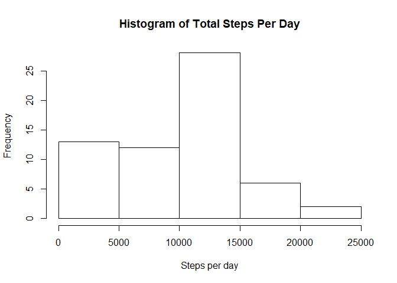
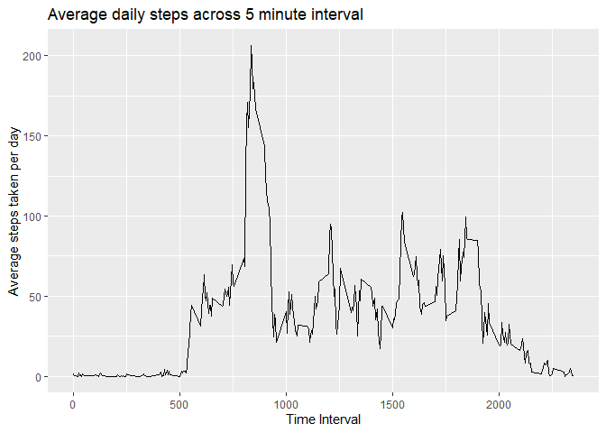
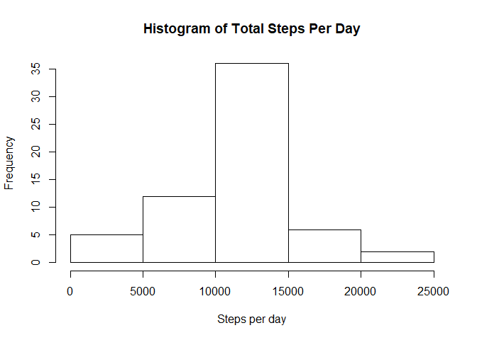
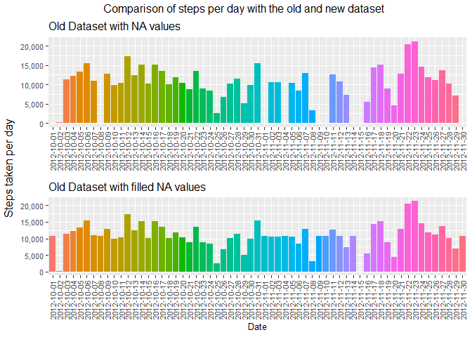
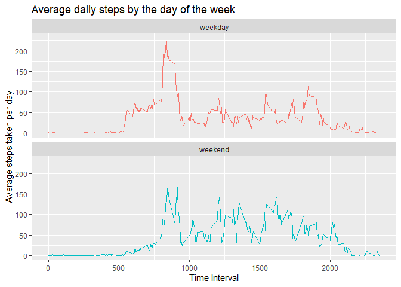

## Introduction

It is now possible to collect a large amount of data about personal movement using activity monitoring devices such as a [Fitbit](https://www.fitbit.com/in/home), [Nike Fuelband](https://www.nike.com/help/a/why-cant-i-sync), or [Jawbone Up](https://www.jawbone.com/up). These type of devices are part of the “quantified self” movement – a group of enthusiasts who take measurements about themselves regularly to improve their health, to find patterns in their behavior, or because they are tech geeks. But these data remain under-utilized both because the raw data are hard to obtain and there is a lack of statistical methods and software for processing and interpreting the data.

This assignment makes use of data from a personal activity monitoring device. This device collects data at 5 minute intervals through out the day. The data consists of two months of data from an anonymous individual collected during the months of October and November, 2012 and include the number of steps taken in 5 minute intervals each day.

## Dataset

Dataset that has been used in this assignment is [Activity Monitor Data](https://d396qusza40orc.cloudfront.net/repdata%2Fdata%2Factivity.zip)

Top 6 rows of the data: 

```r
activity <- read.csv("activity.csv")
head(activity)
```

```
##   steps       date interval
## 1    NA 2012-10-01        0
## 2    NA 2012-10-01        5
## 3    NA 2012-10-01       10
## 4    NA 2012-10-01       15
## 5    NA 2012-10-01       20
## 6    NA 2012-10-01       25
```

The variables included in this dataset are:

* **steps**: Number of steps taking in a 5-minute interval (missing values are coded as NA)
* **date**: The date on which the measurement was taken in YYYY-MM-DD format
* **interval**: Identifier for the 5-minute interval in which measurement was taken

The dataset is stored in a comma-separated-value (CSV) file and there are a total of 17,568 observations in this dataset.

## Question 1:

**What is mean total number of steps taken per day?**

For this part of the assignment, we have ignored the missing values in the dataset.

1. Calculate the total number of steps taken per day
2. Make a histogram of the total number of steps taken each day
3. Calculate and report the mean and median of the total number of steps taken per day

**Answer 1:**

The Total number of steps taken per day:


```r
total.steps <- activity %>% group_by(date) %>% summarize(Steps.per.day = sum(steps,na.rm = TRUE))
total.steps
```

```
## # A tibble: 61 x 2
##    date       Steps.per.day
##    <fct>              <int>
##  1 2012-10-01             0
##  2 2012-10-02           126
##  3 2012-10-03         11352
##  4 2012-10-04         12116
##  5 2012-10-05         13294
##  6 2012-10-06         15420
##  7 2012-10-07         11015
##  8 2012-10-08             0
##  9 2012-10-09         12811
## 10 2012-10-10          9900
## # ... with 51 more rows
```

**Answer 2:**

Histogram of the total number of steps taken each day:


```r
hist(total.steps$Steps.per.day,xlab = "Steps per day", main = "Histogram of Total Steps Per Day")
```

<!-- -->

**Answer 3:**

Mean and median of total steps taken per day:


```r
mean.steps <- mean(total.steps$Steps.per.day,na.rm = TRUE)
median.steps <- median(total.steps$Steps.per.day,na.rm = TRUE)
sprintf("Mean of total steps taken per day: %s",mean.steps)
```

```
## [1] "Mean of total steps taken per day: 9354.22950819672"
```

```r
sprintf("Median of total steps taken per day: %s",median.steps)
```

```
## [1] "Median of total steps taken per day: 10395"
```

## Question 2:

1. Make a time series plot (i.e. type="l") of the 5-minute interval (x-axis) and the average number of steps taken,       averaged across all days (y-axis).
2. Which 5-minute interval, on average across all the days in the dataset, contains the maximum number of steps?

**Answer 1:**

Time series plot:


```r
timeseries <- activity %>% group_by(interval) %>% summarize(Steps.per.day = mean(steps,na.rm = TRUE))
ggplot(data = timeseries,aes(x = interval,y = Steps.per.day,group = 1)) + 
  geom_line() +
  xlab("Time Interval") +
  ylab("Average steps taken per day") +
  ggtitle("Average daily steps across 5 minute interval")
```

<!-- -->

*A time series plot (i.e. type="l") of the 5-minute interval (x-axis) and the average number of steps taken,       averaged across all days (y-axis)*


**Answer 2:**
The 5-minute interval, on average across all the days in the dataset, contains the maximum number of steps:


```r
maximum <- timeseries[which(max(timeseries$Steps.per.day) == timeseries$Steps.per.day),]$interval
maximum
```

```
## [1] 835
```

## Question 3:

**Imputing missing values**
Note that there are a number of days/intervals where there are missing values (coded as NA). The presence of missing days may introduce bias into some calculations or summaries of the data.

 1. Calculate and report the total number of missing values in the dataset (i.e. the total number of rows with        \color{red}{\verb|NA|}NAs)

Total number missing value in the dataset:

```r
sum(is.na(activity$steps))
```

```
## [1] 2304
```
2. Devise a strategy for filling in all of the missing values in the dataset. The strategy does not need to be 
sophisticated. For example, you could use the mean/median for that day, or the mean for that 5-minute interval, etc.

* The strategy that I used in this part of the question is that we replaced NA's with the mean for that 5-minute inteval. The following steps explains the procedure I took to achieve the desired results:
        1. I found all the time intervals which has NA's
        2. Now, we replace those NA's witch mean of the interval.
        

```r
activity.new <- activity
for(i in 1:nrow(activity.new)){
  if(is.na(activity.new[ i , "steps"]) == TRUE){
    time.interval <- activity.new[i ,"interval"]
    step.mean <- round(timeseries[timeseries$interval == time.interval,]$Steps.per.day)
    activity.new[i , "steps"] <- step.mean
  } 
}
```

3. Create a new dataset that is equal to the original dataset but with the missing data filled in.

The new dataset with the missiong data filled in.


```r
head(activity.new)
```

```
##   steps       date interval
## 1     2 2012-10-01        0
## 2     0 2012-10-01        5
## 3     0 2012-10-01       10
## 4     0 2012-10-01       15
## 5     0 2012-10-01       20
## 6     2 2012-10-01       25
```

```r
sum(is.na(activity.new)) ## Checking for ant NA's in the new data set
```

```
## [1] 0
```

4. Make a histogram of the total number of steps taken each day and Calculate and report the mean and median total number of steps taken per day. Do these values differ from the estimates from the first part of the assignment? What is the impact of imputing missing data on the estimates of the total daily number of steps?


```r
total.steps.new <- activity.new %>% group_by(date) %>% summarize(Steps.per.day = sum(steps))
hist(total.steps.new$Steps.per.day,xlab = "Steps per day", main = "Histogram of Total Steps Per Day")
```

<!-- -->

```r
mean.steps <- mean(total.steps.new$Steps.per.day)
median.steps <- median(total.steps.new$Steps.per.day)
sprintf("Mean of total steps taken per day: %s",mean.steps)
```

```
## [1] "Mean of total steps taken per day: 10765.6393442623"
```

```r
sprintf("Median of total steps taken per day: %s",median.steps)
```

```
## [1] "Median of total steps taken per day: 10762"
```

* Mean and median values doesn't differ much because we have filled the missing data according to mean of that 5-minute interval.


```r
plot1 <- ggplot(data = total.steps,aes(x = date, y = Steps.per.day , fill = date))+
  geom_bar(stat = "identity")+
  guides(fill = FALSE)+
  ggtitle("Old Dataset with NA values")+
  scale_y_continuous(labels = comma)+
  theme(text = element_text(size=10),axis.text.x=element_text(angle = 90, vjust = 0.5, hjust = 1),axis.title.x=element_blank(),axis.title.y=element_blank())
  
plot2 <- ggplot(data = total.steps.new,aes(x = date, y = Steps.per.day , fill = date))+
  geom_bar(stat = "identity") +
  guides(fill = FALSE)+
  ggtitle("Old Dataset with filled NA values")+
  xlab("Date")+
  scale_y_continuous(labels = comma)+
  theme(text = element_text(size=10),axis.text.x=element_text(angle = 90, vjust = 0.5, hjust = 1),axis.title.y=element_blank())

grid.arrange(plot1 , plot2 , nrow = 2, top = "Comparison of steps per day with the old and new dataset" , left = "Steps taken per day")
```

<!-- -->

*From the above two comparison bargraph of the two dataset we can conclude that there has been slight changes in the data set with the missing values filled. As we can see that on the date 1st October; total steps taken that has now has a value over 10000.*

## Question 4:

**Are there differences in activity patterns between weekdays and weekends?**

For this part the \color{red}{\verb|weekdays()|}weekdays() function may be of some help here. Use the dataset with the filled-in missing values for this part.

Create a new factor variable in the dataset with two levels – “weekday” and “weekend” indicating whether a given date is a weekday or weekend day.
Make a panel plot containing a time series plot (i.e. \color{red}{\verb|type = "l"|}type="l") of the 5-minute interval (x-axis) and the average number of steps taken, averaged across all weekday days or weekend days (y-axis). See the README file in the GitHub repository to see an example of what this plot should look like using simulated data.


```r
wkday <- weekdays(as.Date(activity.new$date))
for (day in 1:length(wkday)) {
  if(wkday[day] == "Sunday" | wkday[day] == "Saturday"){
    wkday[day] <- "weekend"
  }
  else{
    wkday[day] <- "weekday"
  }
}
wkday <- as.factor(wkday)
activity.new$datetype <- wkday
timeseries.new <- activity.new %>% group_by(interval,datetype) %>% summarize(Steps.per.day = mean(steps))
ggplot(data = timeseries.new,aes(x = interval,y = Steps.per.day,color = datetype)) + 
   geom_line() +
   xlab("Time Interval") +
   facet_wrap(datetype~.,nrow = 2)+    
   ylab("Average steps taken per day") +
   ggtitle("Average daily steps by the day of the week")+
   guides(color = FALSE)
```

<!-- -->


*A time series plot (i.e. \color{red}{\verb|type = "l"|}type="l") of the 5-minute interval (x-axis) and the average number of steps taken, averaged across all weekday days or weekend days (y-axis).*

**Answer:** As we can infer from the above plot that in the weekday, the average daily steps taken by the user is less as compared to the weekend. We can also observe that the user has taken most number of steps(i.e. 230) in the weekday while the maximum number of steps taken by the user in the weekend is 167. But the most activity by the user is shown in the weekend.

